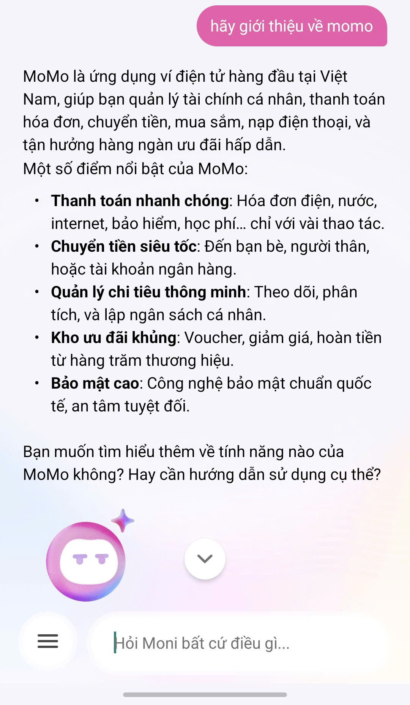
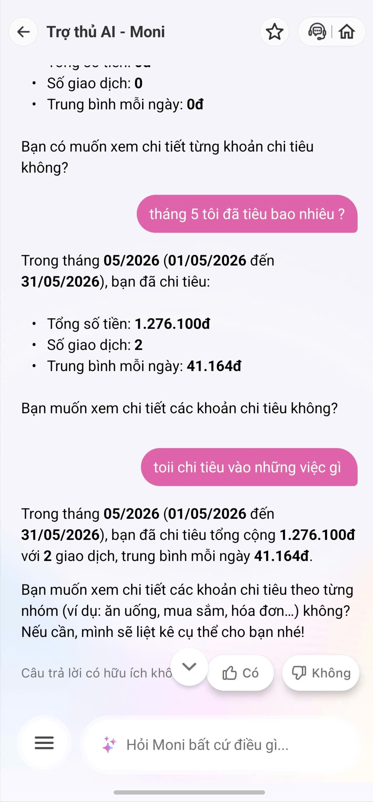
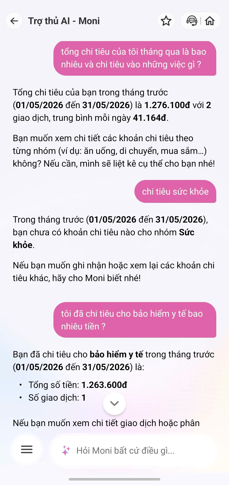
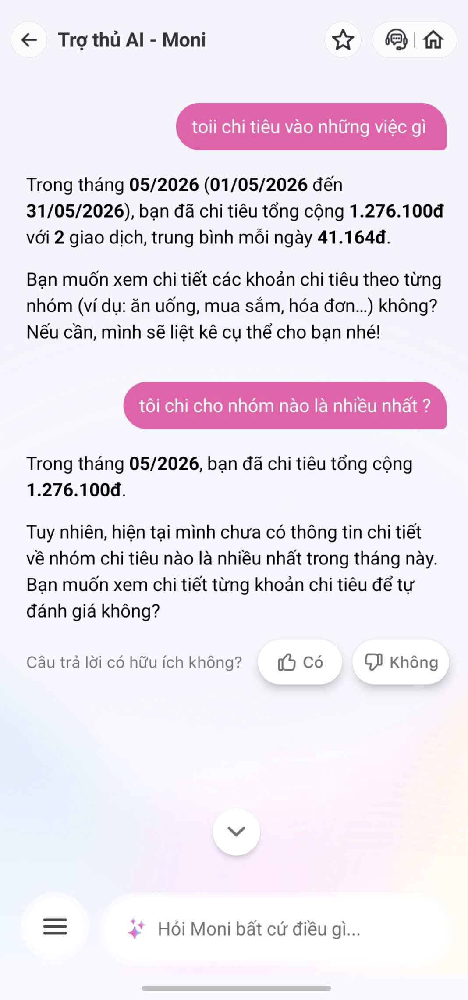

# Workshop — Mổ App AI Thật

**Thời gian:** 35-45 phút  
**Hình thức:** cá nhân trước, chia sẻ theo nhóm sau  
**Output:** finding note + sketch `as-is / to-be`

Mục tiêu không phải chấm "UI đẹp hay xấu". Mục tiêu là dùng sản phẩm thật như một bài needfinding: tìm chỗ product gãy trong workflow thật, rồi viết finding đó thành quyết định product.

## 1. Chọn một sản phẩm để dùng thử

| Sản phẩm | AI feature | Cách truy cập |
|---|---|---|
| MoMo — Moni | Trợ thủ tài chính, phân tích chi tiêu, chatbot | App MoMo |

## 2. Dùng thử: promise vs reality

**Ghi nhanh:**
- **Product hứa gì?** Giúp người dùng quản lý tài chính cá nhân, phân tích chi tiêu thông minh.
- **User nào được hứa sẽ được giúp?** Người dùng MoMo muốn theo dõi và kiểm soát chi tiêu.
- **Bạn kỳ vọng AI làm được task nào?** Có thể phân loại đúng danh mục (Sức khỏe, Bảo hiểm y tế...) và phân tích số liệu cơ bản (ví dụ: tìm ra khoản chi tiêu lớn nhất).
- **Khi dùng thật, điểm gãy xuất hiện ở đâu?** Bot phân loại sai/mâu thuẫn danh mục con và danh mục cha (Bảo hiểm y tế vs Sức khỏe) và không có khả năng so sánh/tìm ra nhóm chi tiêu nhiều nhất.

**Evidence:**
- Screenshots: 
  | **Happy Path** (Truy vấn chung) | **Low-confidence Path** (Hỏi lại an toàn) |
  | :---: | :---: |
  |  |  |
  | **Failure Path** (Lỗi Ontology dữ liệu) | **Failure Path** (Từ chối phân tích tính toán) |
  |  |  |
- Prompt đã thử: *"tôi chi cho nhóm nào là nhiều nhất ?"*, *"chi tiêu sức khỏe"* vs *"tôi đã chi tiêu cho bảo hiểm y tế bao nhiêu tiền ?"*
- Hành vi quan sát được: Báo sức khỏe 0đ nhưng bảo hiểm y tế lại có 1.263.600đ. Từ chối tính toán nhóm nhiều nhất và bảo user tự đánh giá.

## 3. Vẽ 4 paths

| Path | Tình trạng trong app MoMo (Moni) |
|---|---|
| **Happy** | Khi truy vấn số tổng ("Tháng 5 tiêu bao nhiêu"), bot trả về số tiền cực nhanh và chính xác (1.276.100đ). |
| **Low-confidence** | Khi user hỏi nhiều ý hoặc sai chính tả ("toii chi tiêu..."), bot báo cáo số tổng an toàn và hỏi lại: "Bạn muốn xem chi tiết... không?" thay vì tự liệt kê trực tiếp. |
| **Failure** | Lỗi phân loại dữ liệu (Sức khoẻ 0đ, nhưng Bảo hiểm Y tế >1,2tr) và Lỗi không phân tích so sánh được. User nhận ra ngay do bot trả lời mâu thuẫn và thú nhận "chưa có thông tin". |
| **Correction** | Hiện tại **KHÔNG CÓ** path này. Khi bot phân loại sai nhóm chi tiêu, không có UI/nút nào để user gán lại nhóm (vd: đổi Bảo hiểm vào nhóm Sức khoẻ) để dạy bot trên khung chat. |

## 4. Viết finding thành quyết định

**Finding 1 (Lỗi Data/Ontology):**
```text
Khi user truy vấn chi tiết theo nhóm danh mục ("sức khỏe" vs "bảo hiểm y tế"),
AI báo cáo số liệu mâu thuẫn (Sức khỏe 0đ nhưng Bảo hiểm y tế 1.2tr) do không hiểu quan hệ mẹ-con của danh mục,
hậu quả là user mất niềm tin vào độ chính xác của trợ lý quản lý chi tiêu.
Lỗi thuộc layer Data-tool (thiếu chuẩn hóa Ontology) và UX Recovery (không cho sửa).
Nên sửa bằng cách thêm Correction Path: Khi liệt kê khoản chi, cho phép user bấm [Đổi nhóm chi tiêu] để dạy bot học lại.
```

**Finding 2 (Lỗi Intent/Data-tool):**
```text
Khi user hỏi câu hỏi phân tích so sánh ("chi cho nhóm nào là nhiều nhất"),
AI từ chối trả lời và đẩy việc lại cho user ("bạn muốn xem chi tiết tự đánh giá không"),
hậu quả là user cảm thấy AI vô dụng vì không làm được task phân tích cơ bản nhất.
Lỗi thuộc layer Data-tool (AI không kết nối được với hàm sorting/tính toán lớn nhất).
Nên sửa bằng cách trang bị tool phân tích dữ liệu cho agent hoặc hiển thị trực quan biểu đồ hình tròn (Pie chart) thay vì trả lời bằng text.
```

## 5. Sketch as-is / to-be

**As-is Flow (Điểm gãy):**
1. User: "Tôi chi nhóm nào nhiều nhất?" 
2. AI: "Mình chưa có thông tin. Bạn tự đánh giá không?" -> [Gãy: Không đáp ứng được kỳ vọng tính toán]
3. User: "Chi tiêu sức khỏe?" -> AI: "0đ"
4. User: "Bảo hiểm y tế?" -> AI: "1.2tr" -> [Gãy: Mâu thuẫn dữ liệu mẹ-con, không có nút sửa lỗi]

**To-be Flow (Đề xuất sửa - Bổ sung Data Tool & Correction Path):**
1. User: "Tôi chi nhóm nào nhiều nhất?"
2. AI (Dùng tool Analytics): "Tháng này bạn chi nhiều nhất cho **Bảo hiểm Y tế (1.263.600đ)**, chiếm 99% tổng chi tiêu." + *Kèm một Pie chart nhỏ UI*.
3. User: "Ủa sao nãy hỏi sức khoẻ bảo 0đ?"
4. AI: "Moni xin lỗi, Moni chưa map Bảo hiểm Y tế vào nhóm Sức khoẻ. Bạn có muốn đổi nhóm cho giao dịch này không?" -> Hiện nút **[Đổi sang nhóm Sức Khoẻ]**.
5. User bấm nút -> System lưu log học lại (Correction).

## 6. Tự kiểm trước khi nộp

- [x] Có ít nhất 1 screenshot hoặc observation cụ thể. (Đã chụp các case lỗi của Moni)
- [x] Có đủ 4 paths hoặc nói rõ path nào chưa có trong product. (Đã chỉ rõ Correction Path đang thiếu)
- [x] Finding được viết thành product decision, không chỉ là nhận xét.
- [x] Sketch có as-is và to-be.
- [x] Có một câu nói rõ finding này sẽ đổi gì trong SPEC. 
      -> **Quyết định cho SPEC:** *Sản phẩm AI tài chính không chỉ cần NLP tốt mà bắt buộc phải có "Data Analysis Tool" (để trả lời các câu hỏi tính toán) và "Correction UI" (để user sửa lại danh mục giao dịch bị phân loại sai).*
